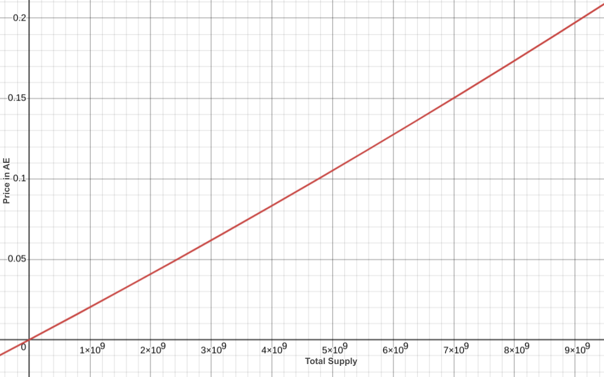

# bctsl-contracts

Repository containing the smart contracts for the Bonding Curve Token Sale Launchpad (BCTSL) protocol built on the æternity blockchain.

## Development and Testing

1. Install aeproject `npm i -g @aeternity/aeproject`
2. Start environment `aeproject env`
3. Install dependencies `npm i`
4. Run tests `aeproject test`

## Architecture

### Community Factory

The [CommunityFactory.aes](contracts/CommunityFactory.aes) implementation, is a comprehensive factory for managing the collection registry, deploying bonding curve token sale, DAO and other supporting contracts specific to a community. This implementation also enables the purchase of an initial token count with the creation of a new community as part of a collection.

The core token sale logic resides in [AffiliationBondingCurveTokenSale.aes](contracts/AffiliationBondingCurveTokenSale.aes). It is deployed via the factory as part of the community creation process.

The factory maintains a registry of created collections, including governance data for community and token naming. Each collection allows the creation of unique tokens within it.

Each created community, along with its associated AEX-9 token, is recorded in a registry of deployed communities. This registry ensures the uniqueness of each community's name within the collection and mandates that the token name matches its symbol. Additionally, it enforces character limitations and requires the use of only whitelisted characters as specified by the collection.

The factory is designed for a one-time, static deployment, after which it can be reused for all future collections. The community registry functions as a means to track community token sales originating from the factory, thereby mitigating potential spam and enabling an index over created communities.

### ProtocolDAO Token

The factory issues protocol DAO tokens during buy transactions. These protocol DAO tokens are AEX-9 tokens designed to encourage user participation on the platform. Users can stake these tokens to vote on proposals in the future. This mechanism aims to foster a more engaged and active community within the platform. Additionally, staking these tokens may provide users with various benefits and incentives. Users receive ProtocolDAO-tokens equivalent to 1,000 times the value of the each buy transaction. While the functionality for the ProtocolDAO is not yet implemented, the ProtocolDAO-token serves as a foundation for future governance and signaling mechanisms.

### Community Management

The [CommunityManagement.aes](contracts/CommunityManagement.aes) contract, is integral to the setup, serving the community meta information and management. The contract is deployed as part of the community creation process through the factory contract. It includes a system for managing moderator accounts, which are appointed through DAO votes.

These moderator accounts are empowered to designate certain users as 'muted' within the contract. Additionally, the module specifies the minimum token amount required for write access in the respective community for users with verified accounts. This threshold can be altered through a DAO vote.

### DAO and DAO Vote

The [DAO.aes](contracts/DAO.aes) contract, deployed via the factory, serves dual roles as both the owner and beneficiary of a token sale. This contract receives all proceeds from the token sale and has administrative authority over it.

Within this framework, token holders that, at the given time, own greater or equal to the community threshold amount of tokens, can initiate new token votes via the DAO contract, requiring a donation of 555 AE towards the DAO, addressing various subjects:

 - `VotePayout` This vote subject concerns disbursing the entire balance of the DAO to the specified account.
 - `VotePayoutAmount` This vote subject concerns disbursing the specified balance of the DAO to the specified account.
 - `ChangeDAO` Used to transfer complete control of the DAO - including ownership, beneficiary rights of the token sale, and accumulated funds - to another DAO. The new DAO contract must implement the `is_dao() = true` method to prevent unintended transfers to non-DAO accounts.

Additional vote subjects are implemented for community and community management:

 - `ChangeMinimumTokenThreshold` Alters the minimum token threshold required in community management.
 - `AddModerator` Appoints a new moderator to the community.
 - `DeleteModerator` Removes a moderator from the community.

Each vote is set with a closing height of 2 weeks, measured in key-blocks, defining the period within which token holders can participate.

The user interaction with the voting process includes several possible actions:

 - `vote` Records a token holder's preference (in favor or against) on a subject. The tokens used for voting must be allowed for the vote contract and will be locked by it.
 - `revoke_vote` Allows a token holder to retract their vote and reclaim their locked token stake.
 - `withdraw` After the vote's closing height, this function enables users to retrieve their locked token stake without impacting the vote's outcome.

Votes must meet certain criteria to be executed by the DAO:
- Initiating a vote requires paying 555 AE, which goes to the DAO.
 - Votes remain open for two weeks, measured in key-blocks.
 - A minimum of 55% of the vote stake in favor.
 - Participation of at least 10% of the total token stake.

Successful votes are time-sensitive:
  - Default expiration of approximately 2 days after the vote closes.
  - During this period, the result must be executed or applied.
  - The application of successful votes can be triggered by any account or even a script via the DAO contract.

[ReplaceableDAO.aes](contracts/interfaces/ReplaceableDAO.aes) implements an interface that community-provided DAOs have to provide in order to be used with the system and to be replaced via a `ChangeDAO` vote.

 - `record_sale_transaction` should be used in replaceable dao implementations and token sales for the DAO to receive proceeds with additional metadata, rather than via Chain.spend. This might be used as an upgrade path for additional logic on how proceeds might be split or used.

### Exponential Bonding Curve

The bonding curve contract for community is specified in [BondingCurveExponential.aes](contracts/BondingCurveExponential.aes). This implements the interface of the BondingCurve found in [BondingCurve.aes](contracts/interfaces/BondingCurve.aes).

This contract is designed to manage the selling and buying of tokens at prices that vary based on the current supply. The difference in buy and sell curves represents the beneficiary's reward. Notably, selling back the entire supply to the curve is always possible, as the necessary funds are maintained in reserve, in the token sale contract.

It's anticipated that only 10-20% of the total supply will be reached, ensuring a noticeable price increase right from the start of the curve.

Affiliation token sale contract implements an additional 0.5% affiliation fee thus the total spread between buy and sell price is 1% (0.5% to DAO + 0.5% to Affiliation).

Full buy curve: 

#### Mathematical Definition
Define the function $buy(x)$:

$$
buy(x) = f(x)=e^{(0.00000000002 \cdot x)} - 0.9999999999
$$

Define the function $sell(x)$:

$$
sell(x) = buy(x) \cdot 0.995
$$

Such that the buy price is defined as:

$$
\int_{supply}^{supply+amount} buy(x) \, dx
$$

And the sell return is defined as:

$$
\int_{supply-amount}^{supply} sell(x) \, dx
$$

Resulting in the spread (i.e. community DAO benefit) definition:

$$
\int_{0}^{supply} buy(x) \, dx - \int_{0}^{supply} sell(x) \, dx
$$

#### Sophia Adaptation

Due to the exponential nature of our bonding curve, the integral calculation required to determine the cumulative cost of tokens or transaction volume can be simplified by leveraging a Taylor series approximation. Specifically, we approximate the exponential function `e^x` using the McLaurin expansion, a form of Taylor series. This approach breaks the complex calculation of `𝑒^x` into a series of smaller terms involving powers of `x` and factorials, making it computationally efficient. The area under the curve, representing the cumulative transaction volume or total price, is thus calculated iteratively by summing these terms up to a sufficient level of precision, ensuring an accurate yet efficient estimation without relying on symbolic or numerical integration.

##### 1. Calculate Price Function
The price for a given number of tokens (`count`) is determined based on the total supply (`total_supply`):

$$
\text{calculateprice}(\text{totalsupply}, \text{count}) =
\frac{\text{initialprice} \cdot \text{count}}{\text{decimals}} +
\frac{\text{mc2}(k \cdot (\text{totalsupply} + \text{count})) - \text{mc2}(k \cdot \text{totalsupply})}{k}
$$

Where:
- $k$: A constant scaling factor.
- $initialprice$: The initial price of the token.
- $decimals$: A scaling constant to account for token precision.

##### 2. Buying Price
The cost of buying tokens is calculated as:

$$
\text{calculatebuyprice}(\text{totalsupply}, \text{count}) = \text{calculateprice}(\text{totalsupply}, \text{count})
$$

---

##### 3. Selling Return
The return for selling tokens (`sell_tokens`) is:

$$
\text{calculatesellreturn}(\text{totalsupply}, \text{selltokens}) = 
\frac{\text{calculateprice}(\text{totalsupply} - \text{selltokens}, \text{selltokens}) \cdot \text{state.sellreturnpercentage}}{10000}
$$

Where:
- $sellreturnpercentage$: The percentage of the calculated sell price that is returned to the seller.

##### 4. Maclaurin Expansion for \( e^x \)
The function `mc2(x)` computes an approximation of \( e^x \), starting from the quadratic term of the Maclaurin series:

$$
e^x \approx \sum_{i=2}^{\infty} \frac{x^i}{i!}
$$

For the given implementation, this approximation is calculated recursively via:

$$
\text{exphelper}(x, \text{term}, \text{sum}, i, \text{scale}) =
\begin{cases} 
\text{sum}, & \text{if } i > 100 \text{ or } \text{term} < 1 \\
\text{exphelper}(x, \text{nextterm}, \text{sum} + \text{nextterm}, i + 1, \text{scale}), & \text{otherwise}
\end{cases}
$$

Where:

$$
\text{nextterm} = \frac{\text{term} \cdot x}{i \cdot \text{scale}}
$$

Where:
- $i$: The current term index.
- $scale = decimals^2$: Precision scaling for integer arithmetic.

#### Curve Configuration

To try different variations of the curve the `k` and `initial_price` values in [BondingCurveExponential.aes](contracts/BondingCurveExponential.aes)... are crucial.
For any curve $f(x)=e^{(a \cdot x)} - c$, $k=a*10^{18}$ and $initialprice=(1-c)*10^{18}$

E.g. for the curve $f(x)=e^{(0.000000005 \cdot x)} - 0.999999$ the constants would be set as `k = 5 * 10 ^ 9` and `initial_price = 1 * 10 ^ 12`.

To try those configurations with example values the following test-case can be used:

1. ensure up-to-date docker and nodejs (>=20) are installed
2. Install aeproject `npm i -g @aeternity/aeproject`
3. Install dependencies `npm i`
4. Start environment `aeproject env`
5. `npx mocha test/tryBondingCurveConfigurations.js`

The resulting "AE/Token" price would be considered the value on the y axis for "x Tokens" on the x axis and the resulting "AE" amount the integral from 0 to x.

To prepare a given curve for production use all test-cases should be adjusted for the changed pricing and re-run using `npm run test`. 

### Affiliation Bonding Curve Token Sale

The [AffiliationBondingCurveTokenSale.aes](contracts/AffiliationBondingCurveTokenSale.aes) contract is an advanced implementation of a token sale mechanism that combines the features of a bonding curve based token sale with an affiliation system.

Referral rewards are split across four levels, rewarding users for actively promoting the platform and growth of the community. When an invitee buys tokens, 0.5% of the transaction value is split between the chain of inviters. The reward is distributed among the referrer and higher levels in the referral chain as follows:

- Level 1: 0.3%
- Level 2: 0.125%
- Level 3: 0.05%
- Level 4: 0.025%

This multi-tier referral system ensures that the rewards of community expansion are distributed among several participants, promoting a cooperative and active user community. Additionally, transaction fees from unaffiliated purchases are burned.

It implements the interface for token sales as defined in [TokenSale.aes](contracts/interfaces/TokenSale.aes), while using the Bonding Curve and implements a revenue share with the implemented affiliation system in [AffiliationTreasury.aes](contracts/AffiliationTreasury.aes).

### Miscellaneous

The `generated` folder contains pre-compiled bytecode, aci, source hashes and module.exports contracts source as generated by `postinstall` and `npm run generate-bytecode-aci-hashes`.

The [deploy-testnet.js](.scripts/deploy-testnet.js) script can be used to deploy a given factory configuration to testnet, a secret-key needs to be provided for the memory account.

## License

This project is licensed under the ISC License - see the [LICENSE](LICENSE) file for details.

Copyright (c) 2024, BCTSL
